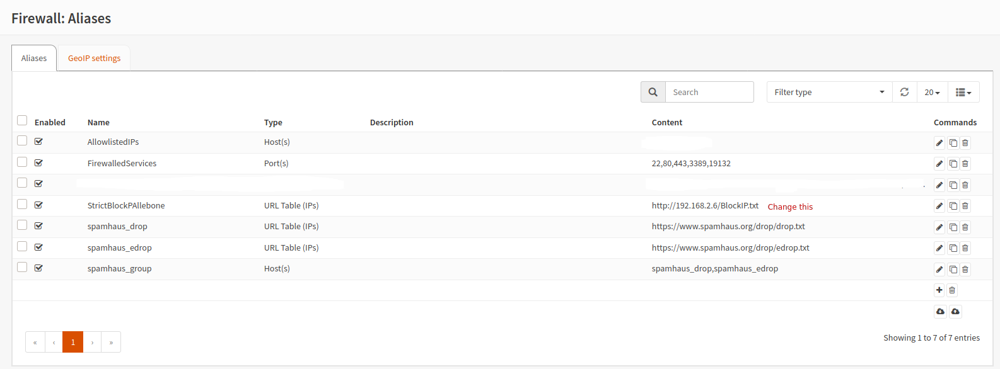
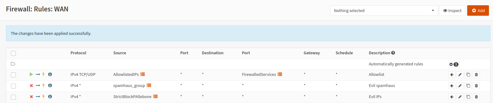

# StrictBlockPAllebone
Manually curated IP Blocklist. Recommended only to update your firewalls weekly with this list. Please read how to use before implementing.

##### Quick Setup lists:

Direct link to this list:

https://raw.githubusercontent.com/pallebone/StrictBlockPAllebone/master/BlockIP.txt

Other Lists used:

https://www.spamhaus.org/drop/drop.txt

https://www.spamhaus.org/drop/edrop.txt

https://raw.githubusercontent.com/ktsaou/blocklist-ipsets/master/firehol_level1.netset

##### Setup expects you to implement all 4 lists for proper protection.

# Notes/Warnings

It is possible that a legitimate IP might be blocked by this list, so it is reccomended that if you find someone is blocked to your services by this list, that you have an allowlist setup to accomodate that possibility. This list is simply what I created, on my own, using my own tools and detection methods, if some legitimate IP gets blocked in error, I am sorry. I obviously cannot guarantee 100% accuracy nor should you expect it. 

In addition, the list is fairly strict. Once an IP gets added, its considered risky and wont be removed for an entire 12-13 months or so. This might seem unfair, but risky networks have no place expecting their traffic to pass firewalls, and should be encoraged to take better care. This means this list is not for everyone, nor every application. Please make an assesment to see if this list works for you, before simply using it. It will block a lot, for a long time, so take that in mind.

If you feel an IP is listed that should not be, raise a ticket and I will make an assesment. Removal of Ip's from the list is 100% on a "if I feel like it, I might remove it" basis so ask nicely and be prepared to answer some questions regarding how it got on there to begin with.

# How to use

# Overview:

Note: This guide will show you how to setup the blocklist using a popular firewall, OPNSense. If using a different firewall, simply take the logical steps as approprate for your own firewall.

Before I started this blocklist, I was using the spamhaus ip blocklists (https://www.spamhaus.org/drop/) drop, and edrop.
I found that unfortunatly while 50% or so of malicious IP's were caught, quite a lot still got through.
As I wanted a greater net of blocked IP's, ie around 99%+ of malicious IP's blocked, I started creating my own list manually each day after manually reviewing the logs on my firewall.

This means that the list is only updated, manually, on days I check my logs. Typically this is each day during the week, not at all on weekends, and if I go on holiday there may be a week when its not updated. For this reason, there is no real point in updating the IP blocklist on your firewall more often than around every 7 days (Set this to 3 days if you are insistant you need it refreshed more often). 7 days or 3 days are the values I am expecting you to use in production (and use myself).

The below guide shows how to implement the blocklist, and optionally, create an allowlist for any IP's that you personally find are blocked, but want to allow access to services without having to remove the entire blocklist to do so.

# Implementing:

As the list expects you to already have spamhaus's lists blocked, and is supplementing that list, you should begin by adding the spamhaus blocklists to your firewall.

Step 1: Create the Aliases for the blocklists we will be using, and allowlist if you desire:

(please note my image shows an internal IP that I am updating my list from as I create the lists. You will however NOT use this internal IP obviously. I copy this altered list up to github when I am finished modifying it.

Each item created as follows:

##### FirewalledServices	Port(s)	 	22,80,443,3389,19132

This is the services on the firewall that are open to the outside world and forwarded to various different internal computers behind the firewall.
In my own case, I have an ssh server, a web server, an rdp server and a minecraft server.
These ports must be specified as an alias so that we can add an allow rule later on to these allowed ports, from IP's we want to allow.

##### StrictBlockPAllebone	URL Table (IPs)	 	https://raw.githubusercontent.com/pallebone/StrictBlockPAllebone/master/BlockIP.txt

This is a URL table to the blocklist. I set update period to 7 days.

##### AllowlistedIPs	Host(s)	 	

This is the aliases you will add IP's you want to allow into. In the screenshot you see a random test IP (obscured) I used to check it worked. You will only add your own list of IP's you deem relevant, nothing else. They will not be blocked once you add them.

##### spamhaus_drop	URL Table (IPs)	 	https://www.spamhaus.org/drop/drop.txt

The IP drop list from spamhaus. I set update period to 7 days.

##### spamhaus_edrop	URL Table (IPs)	 	https://www.spamhaus.org/drop/edrop.txt

The IP edrop list from spamhaus. I set update period to 7 days.

##### spamhaus_group	Host(s)	 	spamhaus_drop,spamhaus_edrop

An alias that contains the 2 spamhaus lists in one single alias so we can add just this alias to a firewall rule.

##### EDIT August 2020
I also now use the firehol list (http://iplists.firehol.org/) as it adds additional IP's to the overall blocking infrustructure and means I have to capture less IP's daily as they are already caught by a combination of spamhaus and firehol. I simply added another alias for firehol and added that to the group as per this screenshot:

So in effect you now have 4 blocklists at this point, the 2 spamhaus, the firehol and this one giving you 3 disparate sources of protection.

Step 2:
Create your firewall rules under "firewall - wan" in order to allow and block the relevant traffic as follows:

##### IPv4 TCP/UDP 	AllowlistedIPs  	* 	* 	FirewalledServices  	* 	* 	Allowlist 

This simple rule allows Allowlist IP's to access the ports listed in alias "FirewalledServices" TCP or UDP and tags the label "Allowlist" for review in the logs.

##### IPv4 * 	spamhaus_group  	* 	* 	* 	* 	* 	Evil spamhaus 

This simple block rule blocks any IPv4 address using any protocol, that is on the blocklist to any and all services on the firewall. It marks a label "Evil spamhaus" for review in the logs.

##### IPv4 * 	StrictBlockPAllebone  	* 	* 	* 	* 	* 	Evil IPs 

Similar to the above rule, but for the blocklist I have created.

Step 3)

The rules now are now created. You can check the aliases work by reviewing the diagnostics - pftables area of the firewall:

You can review the rules are matching traffic in the logs:

You may change the label to "Allowlist" to review logs that matched "Allowlist" in a similar way. Logging will need to be ON on the rules you wish to monitor in the live log.

This concludes the setup. The list should update automatically every 7 days, protecting you from malicious traffic.
